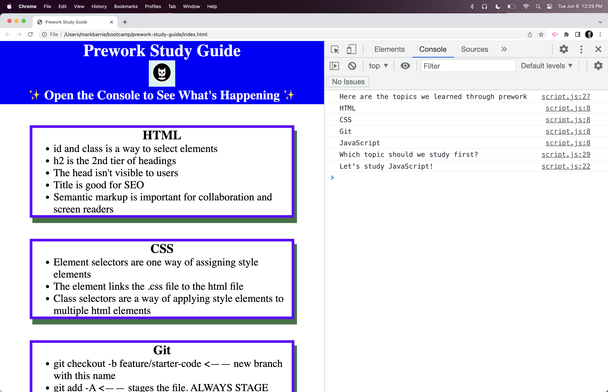

# <Prework Study Guide WebPage>

## Description

This page is meant to aide in studying 4 topics related to Wed Design: HTML, CSS, Git, and JavaScript

I built this webpage to challenge me in the studying process. 
This page was created to help break the monotany of studying, by randomizing the subject to be studied.
Sometimes deciding what to study can feel like a burden in and of itself. Instead, allowing the webpage to decide for you can help with what may feel like a daunting task. 
In the process I learned alot about Git Flow. Working with a remote repo and the flow of syncing files, creating pull requests and merging those requests was very new for me. 
This project also allowed me to experiment with some concepts I already know with JavaScript and CSS.

## Installation

N/A

## Usage

Right click on the .html file and launch in Google Chrome or Chrome Dev Tools.
Hold down option command J (on Mac) or control shift J (on PC).  This shhould open up your console.
It should look like the screen shot provided. 
Refresh the page to see different, random topics to study. 

## Credits

Me

## License

Please refer to the LICENSE in the repo.

